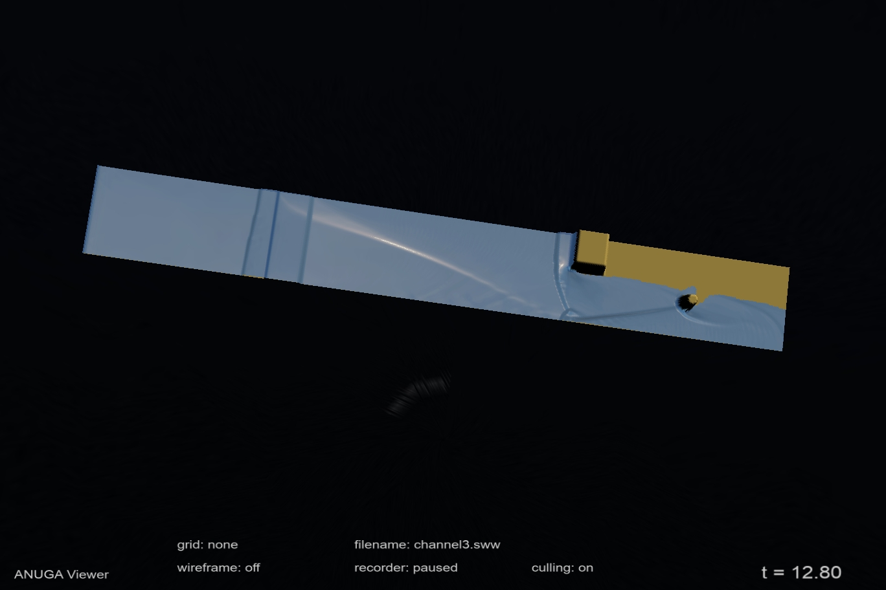

ANUGA viewer documentation
==========================

ANUGA (pronounced "AHnooGAH") is open-source software for the simulation of the shallow water equation, 
in particular it can be used to model tsunamis and floods. `ANUGA documentation <https://anuga.readthedocs.io>`_ 
can be found on `read the docs`

The output from an ANUGA simulation is a `netcdf` file with a `sww` extension. 
SWW files can be viewed using the `anuga-viewer`. 

`anuga-viewer` is developed on `github` at https://github.com/anuga-community/anuga-viewer

ANUGA (and the viewer) was created in a collaboration by Geoscience Australia 
and Mathematical Sciences Institute at the Australian National University. 
It is now developed and maintained by a community of volunteers on `github` at https://github.com/anuga-community.

   View of channel3.sww (produced using `anuga_core/examples/simple_examples/channel3.py`) using the ANUGA viewer

.. toctree::
   :maxdepth: 2
   :caption: Contents:

   installation
   introduction
   

Indices and tables
==================

* :ref:`search`
